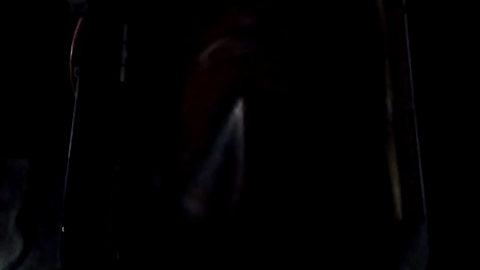
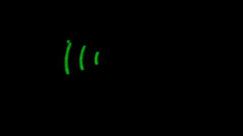

# POVDisplay2

## What is it? 

This is the code for the second, more advanced version of my previous [POVDisplay](https://github.com/Yipten/POVDisplay) project. Instead of having five LEDs that display text around the edge of the circle, this version has 31 LEDs that span from the center to the edge, allowing for images to be drawn anywhere within the entire circle. Since the 2MHz clock speed of an Arduino Nano wouldn't have been fast enough to handle this, an ESP32 with a 240MHz clock speed was used instead. This board also has Wi-Fi and Bluetooth capabilities, which will allow for the possibility of adding wireless controls in the future. 





*The video framerate makes it look worse than it does in real life.*

## Hardware

### Wiring

Connections to the ESP32 microcontroller: 

| ESP32 pin | Connection         |
| --------- | ------------------ |
| micro USB | battery pack USB   |
| 27        | SR SER             |
| 26        | SR OE              |
| 25        | SR RCLK            |
| 33        | SR SRCLK           |
| 32        | SR SRCLR           |
| 34        | hall effect sensor |

Four 8-bit shift registers (abbreviated as SR in the table above) were daisy-chained together for controlling all 31 LEDs at once, since there aren't that many pins on the ESP32. All of the shift register input pins were connected in parallel, except for the serial input (SER), which was set up to pass the last bit of one shift register to the next. This setup created the effect of having one big 32-bit shift register. Each LED was connected to one of the shift register output pins, allowing them to be individually addressable. 

### Assembly

All of the electronic components were soldered together on two solderable PCBs stacked on top of each other using plastic spacers. The bottom PCB had the ESP32 and shift registers, and the top one had the LEDs. The PCBs were screwed onto the board of 1/8 inch MDF, and the battery pack was mounted with a couple of velcro straps. 

Once all of the hardware was assembled, it looked like this: 


## Use

### Changing displayed image

The output of the display is changed by changing the array `Display::grid` when the program starts by calling functions that modify it in the `draw()` function. All of the drawing functions are fully working except for `Display::drawLine` which is incomplete. These drawing functions work by figuring out the Cartesian coordinates of the required points, and then calling `Display::addPoint()` for each, which converts them from Cartesian to polar coordinates and sets the corresponding element in `Display::grid` to `1`. The origin is the center of the display, and Quadrant I (where x and y are both positive) is on the bottom-right. 

For example, to draw a 20-by-30 filled-in rectangle centered on the origin, the `draw()` method would look like this: 

```cpp
void draw() {
    Display::clear();
    Display::fillRect(-10, -15, 20, 30);
}
```

### Making it go

To run the display: 
- Upload the program to the ESP32
- Power on the battery pack
- Turn on the fan motor

## How does it work? 

This POV Display works in mostly the same way as my previous one. A 2-dimensional array represents which LEDs should be turned on and where, and the timing is managed using a hall effect sensor and timestamps. The only major difference is that the sensor causes an interrupt which causes the program to skip ahead to the beginning of the next iteration of the main loop. This change was necessary to allow "drawing" to occur throughout the entire circle instead of relying on a buffer like before. 

Also, as mentioned before, shift registers were used to drive the LEDs instead of directly using the microcontroller's output pins. In the innermost `for` loop, bits were shifted in one at a time, and then moved in parallel to the storage register to cause visual changes to happen all at once. 

